
<h1 align="center">党员教育和管理系统</h1>

## 简介
党员教育和管理系统：角色分为管理员和用户；功能包括党员信息管理、支部管理、奖惩记录管理、日志管理、荣誉类型管理等模块，通过简洁的用户界面提升管理效率和体验。    --计算机毕业设计源码；毕设源码；java毕业设计源码

## 联系方式

<h3 align="center">获取完整代码与数据库文件 + 微信：deepguan QQ: 86050149 QQ群: 783742310</h3>

<h3 align="center">可帮忙远程部署 包运行成功！提供远程部署、修改代码、设计文档指导、代码讲解等服务！</h3>

## 功能介绍（完整见运行截图）
管理员：管理员可以通过个人中心、管理层管理、管理员管理等模块，执行用户信息、党员登记、荣誉类型等数据的新增、修改、删除和权限管理操作。界面提供党费登记管理、奖惩记录管理和支部日志管理功能，并支持搜索和筛选器以帮助管理员有效管理和维护各支部与成员的详细信息和活动记录。

用户：用户在个人中心查看和修改个人信息，包括基本信息输入、修改密码和个人资料更新。用户可以访问党员教育系统的多种功能模块，如党员管理、支部管理、支部日志管理等，查看和管理个人的奖惩记录，并可通过搜索功能查找特定信息，简化党务操作和信息查询。

## 运行截图
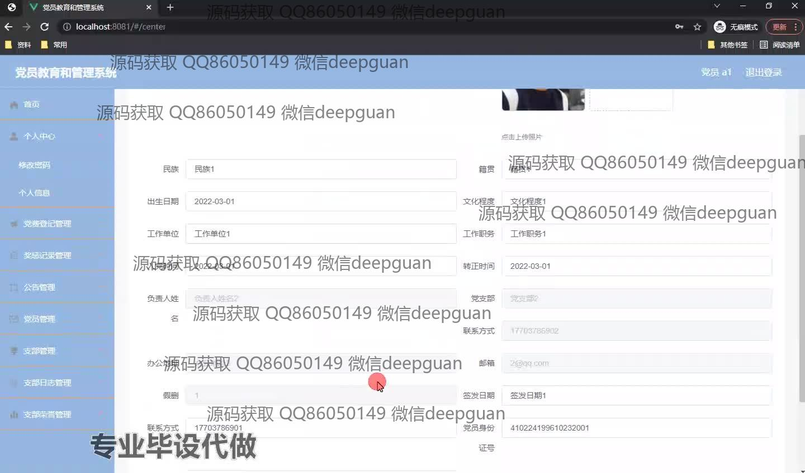
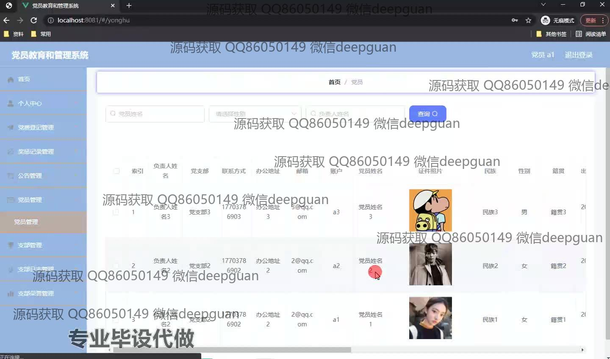
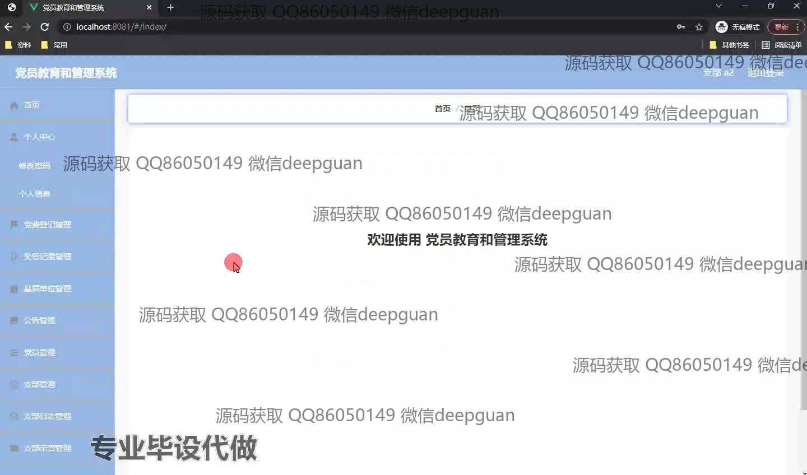
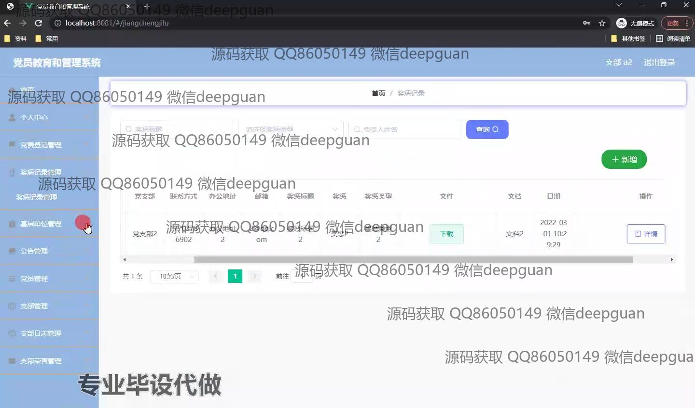
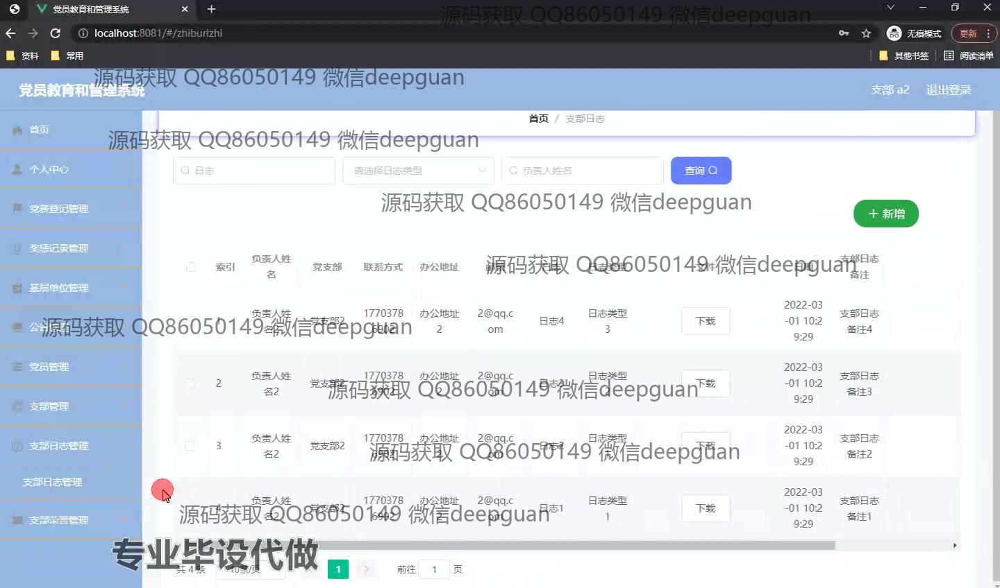
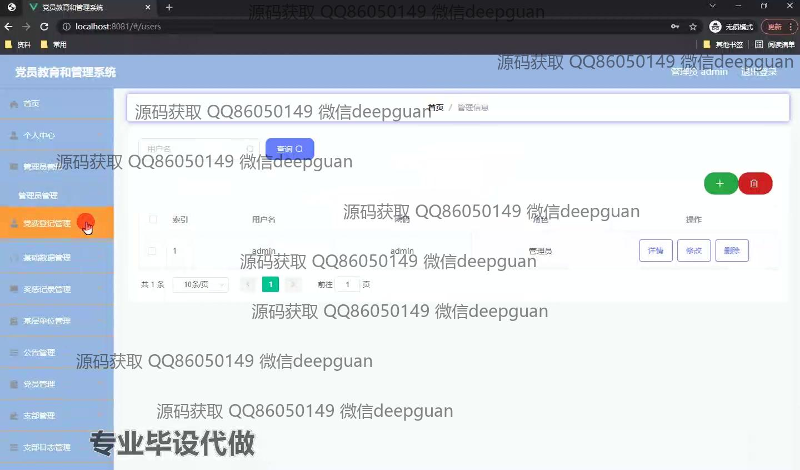
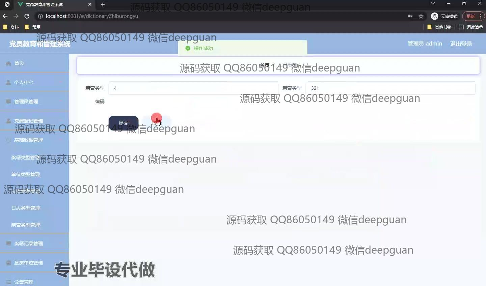

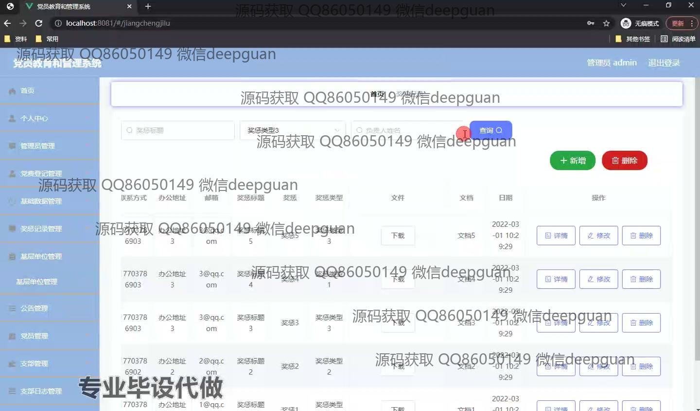
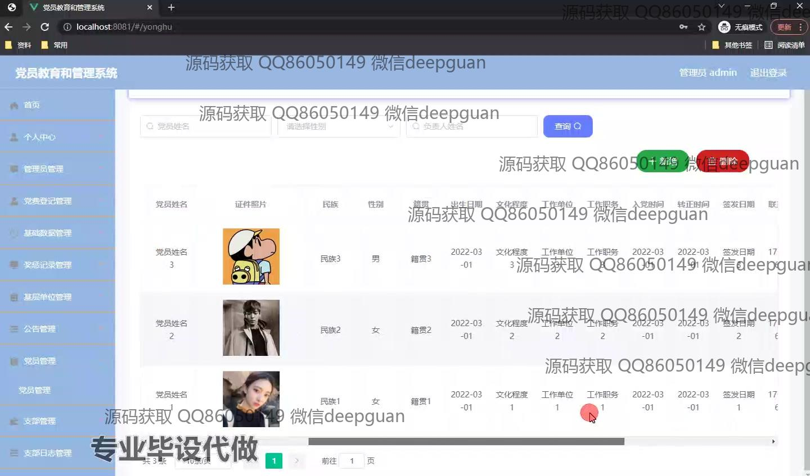
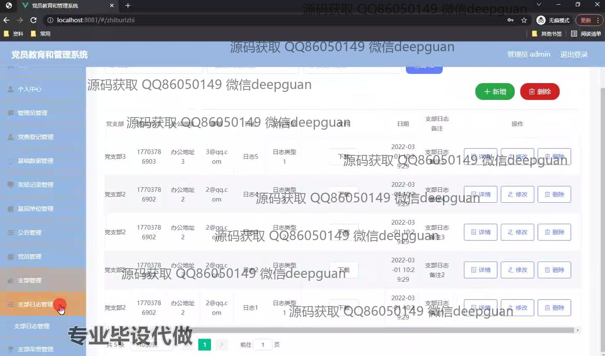
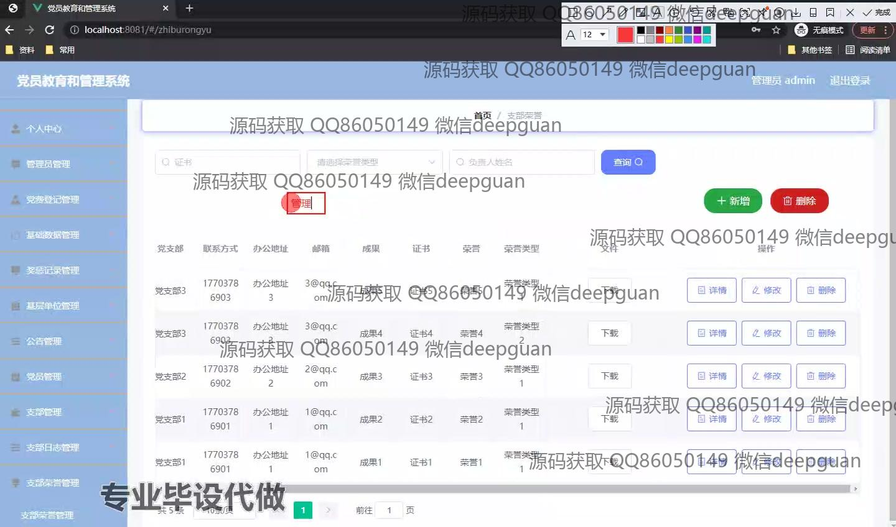
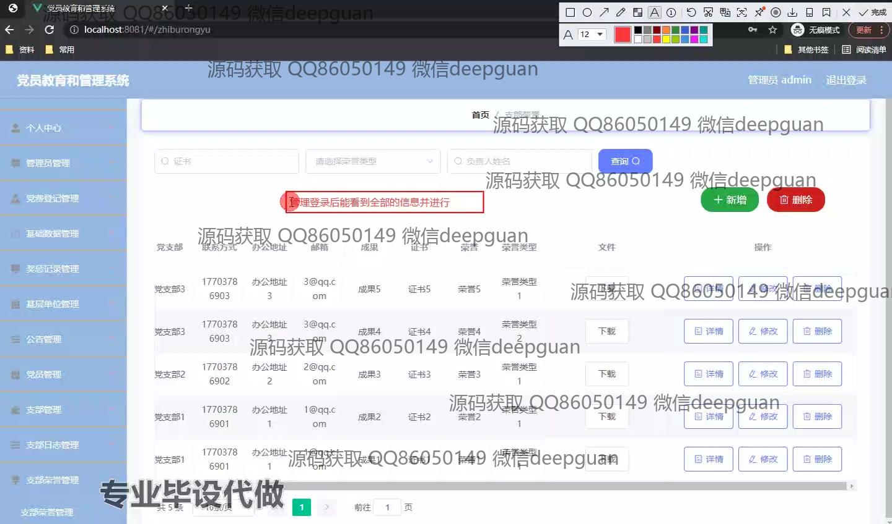
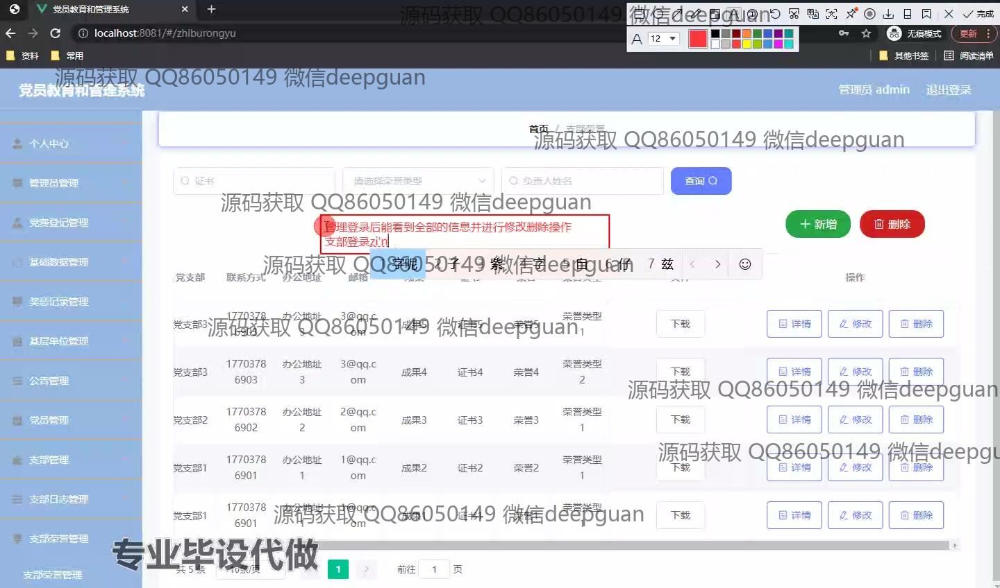
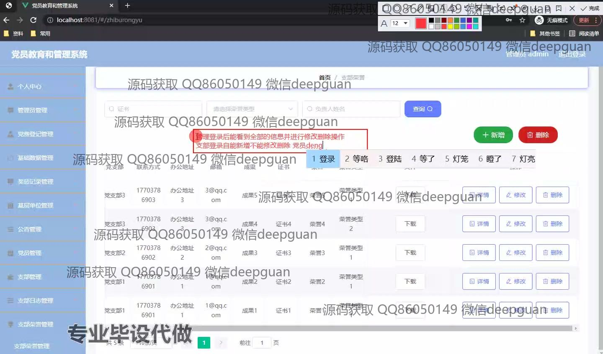

本代码来源于网络,仅供学习参考使用!

